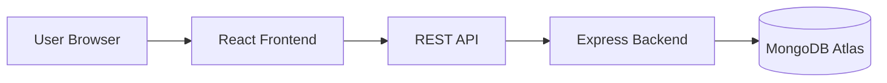
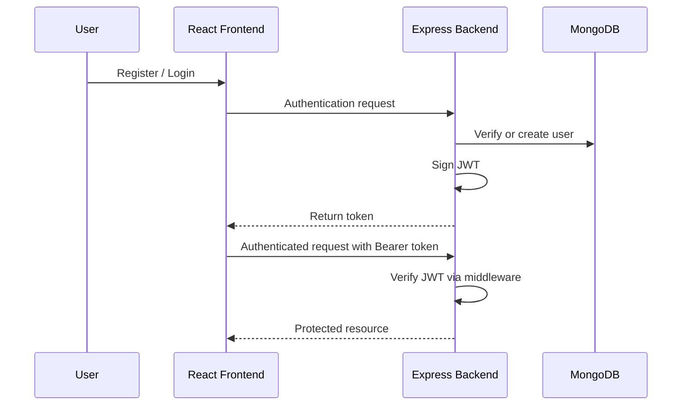
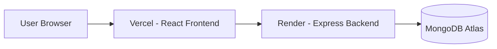

# BookNest

### Production-Oriented MERN Book Commerce Platform

A full-stack online bookstore built with React, Node.js, Express, and MongoDB — featuring JWT authentication, role-based authorization, cart management, order workflows, and an admin-controlled catalog.

---

## Overview

BookNest is a full-stack MERN commerce application designed to demonstrate how a real-world bookstore can be structured beyond a simple frontend interface.

The project combines a React-based client with an Express/MongoDB backend and implements a complete application workflow:

**Authentication → Catalog → Cart → Checkout → Orders → Admin Management**

The project focuses on practical frontend engineering while also demonstrating backend integration, API communication, authentication, authorization, database persistence, and production deployment.

---

## Live Application

**Live Demo:**
https://book-store-frontend-dnvp.vercel.app/

**GitHub Repository:**
https://github.com/nilukadam/booknest

---

## Core Features

### User Experience

* User registration and login
* JWT-based authentication
* Protected application routes
* Browse available books
* Search books
* Sort catalog results
* View book details
* Add books to cart
* Increase/decrease cart quantity
* Remove items from cart
* Checkout and order placement
* View previous orders
* Authentication and cart state management
* Responsive interface

### Admin Experience

* Protected admin access
* Admin dashboard
* Product management
* Add products
* Edit products
* Delete products
* View product and inventory information
* View customer orders
* Manage order status

### Backend Capabilities

* REST API architecture
* JWT authentication
* Password hashing with bcrypt
* Role-based authorization
* Protected API endpoints
* MongoDB persistence
* Mongoose data modeling
* Centralized middleware structure
* Environment-based configuration
* CORS configuration

---

## Feature Status

| Feature                  | Status            |
| ------------------------ | ----------------- |
| User Registration        | ✅ Implemented     |
| User Login               | ✅ Implemented     |
| JWT Authentication       | ✅ Implemented     |
| Role-Based Authorization | ✅ Implemented     |
| Book Catalog             | ✅ Implemented     |
| Search                   | ✅ Implemented     |
| Sorting                  | ✅ Implemented     |
| Cart Management          | ✅ Implemented     |
| Checkout Flow            | ✅ Implemented     |
| Order Creation           | ✅ Implemented     |
| Order History            | ✅ Implemented     |
| Admin Dashboard          | ✅ Implemented     |
| Product CRUD             | ✅ Implemented     |
| Admin Order Management   | ✅ Implemented     |
| MongoDB Persistence      | ✅ Implemented     |
| Payment Gateway          | ⏳ Not implemented |
| Email Verification       | ⏳ Not implemented |
| Wishlist                 | ⏳ Not implemented |
| Sales Analytics          | ⏳ Not implemented |

> Checkout and order placement are implemented as an application workflow. A live payment gateway is not currently integrated.

---

## Application Architecture



---

## Technology Stack

| Layer            | Technologies                           |
| ---------------- | -------------------------------------- |
| Frontend         | React, Vite, React Router, Context API |
| State Management | Context API, custom hooks              |
| Styling          | Bootstrap, Custom CSS                  |
| Backend          | Node.js, Express                       |
| Authentication   | JWT, bcrypt                            |
| Database         | MongoDB Atlas, Mongoose                |
| API              | REST API                               |
| Deployment       | Vercel, Render                         |

---

## Project Structure

```text
booknest/
├── client/
│   ├── public/
│   └── src/
│       ├── api/
│       ├── components/
│       │   ├── Navbar/
│       │   └── ui/
│       ├── context/
│       │   ├── CartContext
│       │   └── OrderContext
│       ├── hooks/
│       │   ├── useAuth
│       │   └── useCartSummary
│       ├── pages/
│       └── utils/
│
├── server/
│   ├── config/
│   ├── controllers/
│   ├── middleware/
│   ├── models/
│   └── routes/
│       ├── authRoutes.js
│       ├── productRoutes.js
│       └── orderRoutes.js
│
├── screenshots/
├── .gitignore
└── README.md
```

---

## Authentication Flow



---

## Authorization Model

| Role  | Access                                                           |
| ----- | ---------------------------------------------------------------- |
| Guest | Browse catalog                                                   |
| User  | Cart, checkout, order history                                    |
| Admin | All user access plus product management and order status control |

Role checks are enforced server-side through middleware rather than relying only on frontend visibility.

---

## API Overview

| API Group       | Responsibility                                                   |
| --------------- | ---------------------------------------------------------------- |
| `/api/auth`     | Registration and login                                           |
| `/api/products` | Catalog access and admin product CRUD                            |
| `/api/orders`   | Order creation, order history, and admin order-status management |

---

## Database Design

| Collection | Purpose                    | Relationship                  |
| ---------- | -------------------------- | ----------------------------- |
| Users      | User credentials and roles | Referenced by Orders          |
| Products   | Book catalog               | Referenced by Orders          |
| Orders     | Placed orders and status   | References Users and Products |

---

## Deployment Architecture



The frontend and backend are deployed independently, allowing each layer to be developed and deployed separately.

---

## Environment Variables

### Backend

```env
MONGODB_URI=
JWT_SECRET=
PORT=
```

### Frontend

```env
VITE_API_BASE_URL=
```

> Environment variable values are not committed to the repository. Each deployment environment supplies its own configuration.

---

## Engineering Decisions

### JWT over Sessions

JWT-based authentication fits the decoupled frontend/backend architecture and allows the API to authenticate requests without maintaining server-side session state.

### Context API over Redux

Shared application state is limited to specific domains such as authentication, cart, and orders. Context API keeps the implementation focused without introducing unnecessary state-management complexity.

### Separate Frontend and Backend Deployments

The React frontend and Node.js backend are deployed independently, allowing each application layer to be maintained and deployed separately.

### Server-Enforced Authorization

Role checks are implemented in backend middleware so protected API endpoints remain protected regardless of what the frontend renders.

### Honest Feature Scope

Features that are not currently implemented are explicitly identified rather than being presented as completed functionality.

---

## How To Run

### 1. Clone the repository

```bash
git clone https://github.com/nilukadam/booknest.git
cd booknest
```

### 2. Start the backend

```bash
cd server
npm install
```

Create a `.env` file inside the `server` directory:

```env
MONGODB_URI=your_mongodb_connection_string
JWT_SECRET=your_jwt_secret
PORT=5000
```

Start the development server:

```bash
npm run dev
```

### 3. Start the frontend

Open a new terminal:

```bash
cd booknest/client
npm install
```

Create a `.env` file inside the `client` directory:

```env
VITE_API_BASE_URL=your_backend_api_url
```

Start the development server:

```bash
npm run dev
```

---

## Future Improvements

The following features are intentionally outside the current implementation scope and can be added in future iterations:

* Live payment gateway integration
* Email verification
* Wishlist functionality
* Sales and analytics dashboard

---

## Project Status

**Status:** Production-deployed full-stack project

BookNest currently demonstrates:

* React frontend development
* REST API integration
* JWT authentication
* Server-side role-based authorization
* MongoDB persistence
* Cart and order workflows
* Admin product management
* Independent frontend/backend deployment
* Production-oriented project documentation

---

## About

BookNest is a full-stack MERN online bookstore built to demonstrate practical frontend engineering together with real backend integration, authentication, authorization, database persistence, and production deployment.

**Live Demo:**
https://book-store-frontend-dnvp.vercel.app/

**Repository:**
https://github.com/nilukadam/booknest
