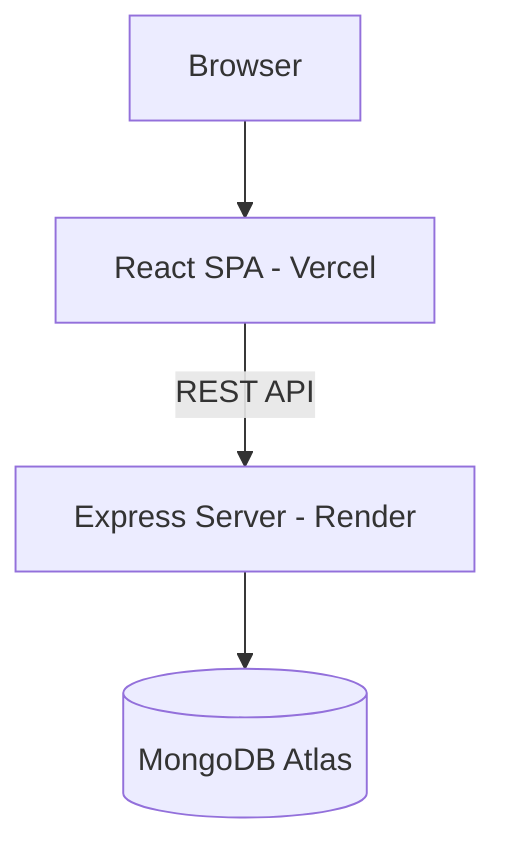
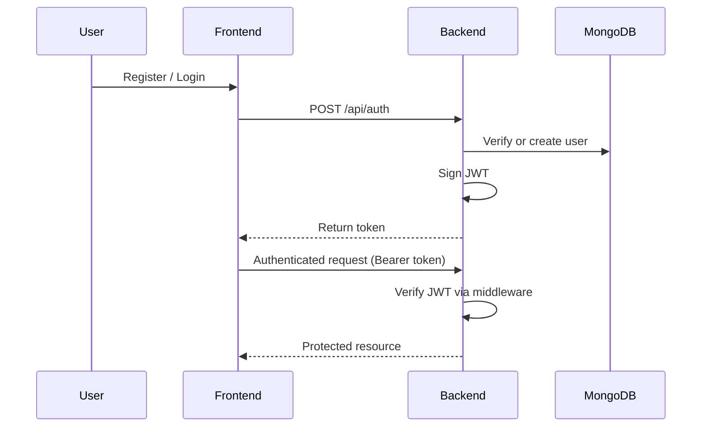
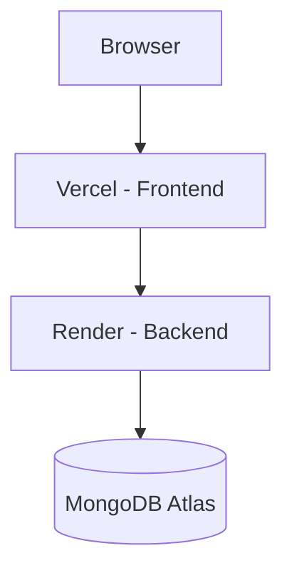

<div align="center">

# BookNest

**Production MERN Book Commerce Platform — Authentication, Orders, and Admin Control**

[]()
[]()
[]()
[]()

[Live Demo](https://book-store-frontend-dnvp.vercel.app/) · [Repository](https://github.com/nilukadam/book-store-frontend)

</div>

---


---

## Quick Snapshot

- Full MERN stack — independently deployed React frontend and Express/MongoDB backend
- Real JWT authentication, enforced server-side via middleware — not a UI-only gate
- Complete commerce flow: catalog → cart → checkout → order history
- Admin-managed product catalog and order status control
- MongoDB Atlas as the persistence layer

---

## Table of Contents

- [Executive Summary](#executive-summary)
- [Why This Project Exists](#why-this-project-exists)
- [Feature Matrix](#feature-matrix)
- [System Architecture](#system-architecture)
- [Technology Stack](#technology-stack)
- [Project Structure](#project-structure)
- [Authentication Flow](#authentication-flow)
- [Authorization Model](#authorization-model)
- [API Overview](#api-overview)
- [Database Design](#database-design)
- [Deployment Architecture](#deployment-architecture)
- [Environment Variables](#environment-variables)
- [Engineering Decisions](#engineering-decisions)
- [How To Run](#how-to-run)
- [Future Roadmap](#future-roadmap)
- [Project Statistics](#project-statistics)
- [Closing](#closing)

---

## Executive Summary

BookNest is a full-stack MERN commerce platform for browsing and purchasing books. It was built to demonstrate ownership of a complete transaction lifecycle — authentication, authorization, cart state, order placement, and admin-side management — backed by a real database rather than simulated in the browser.

The frontend and backend are deployed as independent services communicating over a REST API, with access control enforced at the server, not assumed from the UI.

---

## Why This Project Exists

Most portfolio commerce projects stop at the UI layer — a product grid and a cart that resets on refresh. BookNest was built to go past that boundary: real authentication, a real database, and an admin side treated as a first-class part of the system rather than an afterthought.

The goal was ownership of the full stack, not a frontend pattern in isolation.

---

## Feature Matrix

### User

| Feature | Status |
|---|---|
| Registration & login (JWT) | Implemented |
| Browse and search catalog | Implemented |
| Cart management | Implemented |
| Checkout and order placement | Implemented — checkout flow is simulated, not a live payment gateway |
| Order history | Implemented |
| Email verification | Not implemented |
| Wishlist | Not implemented |

### Admin

| Feature | Status |
|---|---|
| Admin-only route protection | Implemented |
| Product CRUD | Implemented |
| Order status control | Implemented |
| Sales/analytics dashboard | Not implemented |

---

## System Architecture



---

## Technology Stack

| Layer | Technology |
|---|---|
| Frontend | React, Vite, React Router, Context API |
| State | Domain-separated contexts (Cart, Orders), custom hooks (`useAuth`, `useCartSummary`) |
| Styling | Bootstrap + custom CSS |
| Backend | Node.js, Express, JWT |
| Database | MongoDB Atlas + Mongoose |
| Deployment | Vercel (frontend), Render (backend) |

---

## Project Structure

```
client/src/
├── api/
├── components/ (Navbar/, ui/)
├── context/        → CartContext, OrderContext
├── hooks/           → useAuth, useCartSummary
├── pages/
└── utils/

server/
├── config/
├── controllers/
├── middleware/
├── models/
└── routes/          → authRoutes.js, productRoutes.js, orderRoutes.js
```

---

## Authentication Flow



---

## Authorization Model

| Role | Access |
|---|---|
| Guest | Browse catalog only |
| User | Cart, checkout, order history |
| Admin | All user access, plus product management and order status control |

Role checks are enforced server-side via middleware, not just hidden in the UI.

---

## API Overview

| Group | Responsibility |
|---|---|
| `/api/auth` | Registration, login |
| `/api/products` | Catalog read; create/update/delete restricted to admin |
| `/api/orders` | Order creation, user history; status control restricted to admin |

---

## Database Design

| Collection | Purpose | Relationship |
|---|---|---|
| Users | Credentials, role | Referenced by Orders |
| Products | Catalog items | Referenced by Orders |
| Orders | Placed orders, status | References User and Products |

---

## Deployment Architecture



Frontend and backend are deployed independently, so either layer can be redeployed or scaled without touching the other.

---

## Environment Variables

**Backend:** `MONGODB_URI`, `JWT_SECRET`, `PORT`
**Frontend:** `VITE_API_BASE_URL`

Values are never committed — each environment supplies its own.

---

## Engineering Decisions

**JWT over sessions** — stateless auth fits a decoupled frontend/backend deployment where the server holds no session state.

**Context API over Redux** — shared state (cart, orders) is limited in scope; Redux's boilerplate wasn't justified here.

**Separate deployments** — Vercel for static hosting, Render for the long-running Node process — matching each platform to what it's built for.

**Server-enforced authorization** — role checks live in backend middleware, so protected endpoints stay protected regardless of what the frontend renders.

---

## How To Run

```bash
git clone https://github.com/nilukadam/book-store-frontend.git

cd book-store-frontend/server
npm install        # add .env with variables above
npm run dev

cd ../client
npm install         # add .env with VITE_API_BASE_URL
npm run dev
```

---

## 🔮 Future Improvements

- Backend integration with real authentication & database
- Payment gateway integration
- API-based product data
- Admin dashboard for product management
- Order status tracking system
