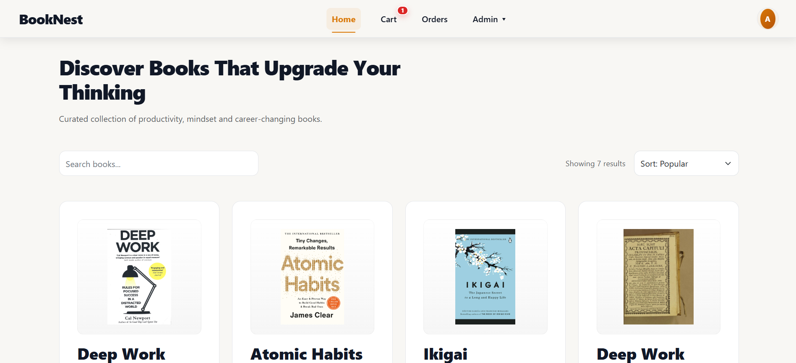

# BookNest

### Production-Oriented MERN Book Commerce Platform

A full-stack online bookstore built with React, Node.js, Express, and MongoDB — featuring JWT authentication, role-based authorization, cart management, order workflows, and an admin-controlled catalog.

<p align="center">
  <a href="https://book-store-frontend-dnvp.vercel.app/">
    <strong>Live Demo</strong>
  </a>
  &nbsp; • &nbsp;
  <a href="https://github.com/nilukadam/booknest">
    <strong>Repository</strong>
  </a>
</p>

---

## Overview

BookNest is a full-stack MERN commerce application designed to demonstrate how a real-world bookstore can be structured beyond a simple frontend interface.

The project combines a React-based client with an Express/MongoDB backend and implements a complete application flow:

**Authentication → Catalog → Cart → Checkout → Orders → Admin Management**

The project focuses on practical frontend engineering while also demonstrating backend integration, API communication, authentication, authorization, database persistence, and production deployment.

---

## Live Application

**Live Demo:**  
https://book-store-frontend-dnvp.vercel.app/

**GitHub Repository:**  
https://github.com/nilukadam/booknest

---

## Product Preview



---

## Core Features

### User Experience

- User registration and login
- JWT-based authentication
- Protected application routes
- Browse available books
- Search books
- Sort catalog results
- View book details
- Add books to cart
- Increase/decrease cart quantity
- Remove items from cart
- Checkout and order placement
- View previous orders
- Persistent application state where required
- Responsive interface

### Admin Experience

- Protected admin access
- Admin dashboard
- Product management
- Add products
- Edit products
- Delete products
- View product inventory
- View customer orders
- Manage order status

### Backend Capabilities

- REST API architecture
- JWT authentication
- Password hashing with bcrypt
- Role-based authorization
- Protected API endpoints
- MongoDB persistence
- Mongoose data modeling
- Centralized middleware structure
- Environment-based configuration
- CORS configuration

---

## Feature Status

| Feature | Status |
|---|---|
| User Registration | ✅ Implemented |
| User Login | ✅ Implemented |
| JWT Authentication | ✅ Implemented |
| Role-Based Authorization | ✅ Implemented |
| Book Catalog | ✅ Implemented |
| Search | ✅ Implemented |
| Sorting | ✅ Implemented |
| Cart Management | ✅ Implemented |
| Checkout Flow | ✅ Implemented |
| Order Creation | ✅ Implemented |
| Order History | ✅ Implemented |
| Admin Dashboard | ✅ Implemented |
| Product CRUD | ✅ Implemented |
| Admin Order Management | ✅ Implemented |
| MongoDB Persistence | ✅ Implemented |
| Payment Gateway | ⏳ Not implemented |
| Email Verification | ⏳ Not implemented |
| Wishlist | ⏳ Not implemented |
| Sales Analytics | ⏳ Not implemented |

> Checkout and order placement are implemented as an application workflow. A live payment gateway is not currently integrated.

---

## Application Architecture

```mermaid
flowchart LR
    U[User Browser]
    F[React Frontend]
    A[REST API]
    B[Express Backend]
    D[(MongoDB Atlas)]

    U --> F
    F --> A
    A --> B
    B --> D